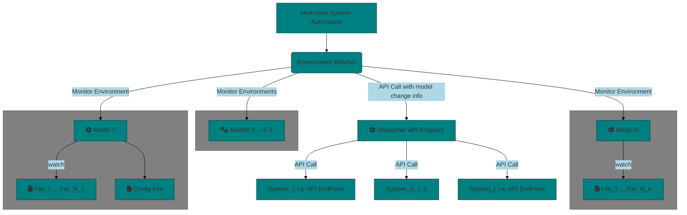

# Automation Involving Multi-System Interaction from a GRC Perspective

## Introduction and Motivation

We claim without rigorous proof (since we believe this is self-evident) that any complex system can be decomposed as a collection of interacting sub-systems. Many business processes can similarly be decomposed. In addition, many software solutions require a mechanism of integrating (at least some components) of existing systems. 
Moreover, when working with vendor systems, there may extra requirements that need to be implemented by vendor to support integration with other systems. For example consider a vendor based modeling platform that is hosted in the cloud environment and accessible via a web interface. To watch this system for changes, one must observe some data underlying the interface. It could be a database for example. If the third-party system does not expose the pertinent data via an API endpoint for example, a request to provide that would be needed.

The use case is the following: Certain business processes should be triggered when certain activities take place. Here are some examples:

## The System
The Diagram below is a summary of the system. There core components are:

- **System Environments** to watch

   - We assume without loss of generality that our systems to watch are models.
   - A config file in the enviroment defines the specifics of monitoring e.g. which files change constitute a change to be monitored in a change management use-case
   - The functionality is in the /msg-dispatcher/src/...
- **Message Dispatcher**
  - This is a go server in ./msg-dispatcher/src/main.go
      - Updates the "database"(proxied by a ./data.json file)
- **View Engine** (Optional but important for illustrative purposes)
   - This is represented by an express application that uses pug as a templating engine in ./view-engine/index.js

## Possible Enhancements
- Dockerization
- (Possibly only Applicable to systems with available source code) - Incorporate a classification of changes to categories based on extent/impact etc. NLP can be leveraged i.e. if the semantics of programming languages can be learned, this can form the basis of classification model 
